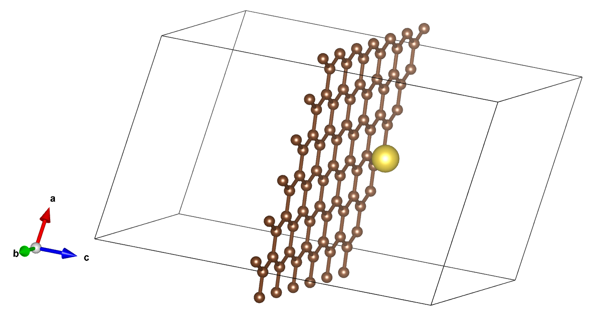
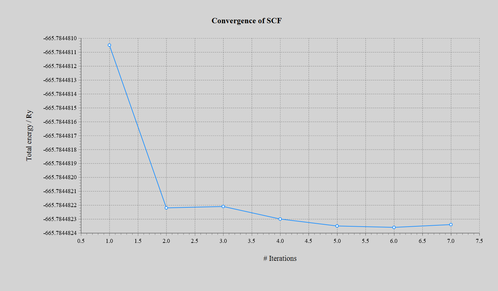
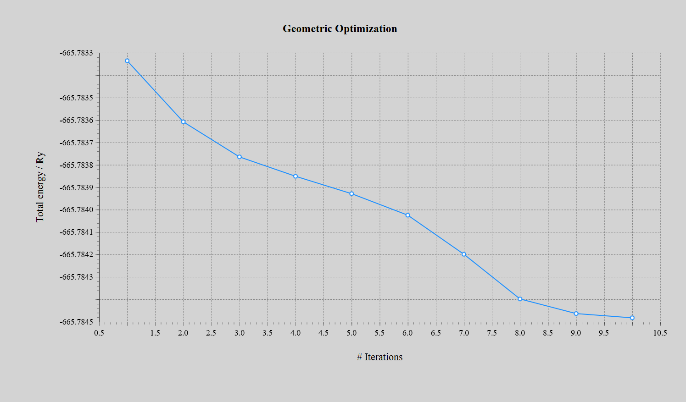

# DFT Study: Sodium Electrosorption on Graphene for CDI

## Project Overview
This repository contains the foundational **Benchmark Study (Phase 1)** for a broader atomistic investigation into carbon-based electrodes for **Capacitive Deionization (CDI)** and water desalination. 

Here, we investigate the electrosorption mechanism of a Sodium (Na) atom/ion on a pristine **Graphene** monolayer. The optimized simulation parameters, pseudo-potentials, and convergence scripts developed in this pristine model serve as the baseline workflow for our ongoing, computationally intensive studies on **Heteroatom-doped (Nitrogen and Oxygen) Graphene structures**. 

The calculations were strictly performed using **Density Functional Theory (DFT)** within the Quantum ESPRESSO package.

---

## Relaxation Trajectory (Atomic Movement)
The animation below demonstrates the dynamic trajectory of the Sodium atom as it seeks the global minimum-energy adsorption site on the Graphene lattice. The ionic relaxation was driven by the BFGS algorithm.

*Final Optimized Structure:*

---

## Electronic & Structural Convergence
To ensure the physical validity and numerical stability of the simulation, both electronic and ionic convergence were rigorously monitored.

### 1. Electronic Minimization (SCF)
The Self-Consistent Field (SCF) iterations rapidly converged within 7 steps, establishing a highly stable electronic ground state for the Na-Graphene system.

### 2. Ionic Relaxation (Energy & Forces)
As the Sodium atom explored the potential energy surface during geometric optimization, the total energy of the system smoothly and monotonically decreased (First Plot). Simultaneously, the atomic forces were successfully minimized toward the convergence threshold (Second Plot), confirming the system reached its most stable configuration in exactly 10 iterations.

 

---

## Computational Workflow & Inputs
This project demonstrates a hierarchical simulation approach to balance accuracy and computational cost:
1. **Model Construction:** Built a $5 \times 5$ graphene supercell (50 Carbon atoms) with a 20 Å vacuum layer along the z-axis to prevent periodic image interactions.
2. **Parameter Optimization:** Convergence tests for Kinetic Energy Cutoff ($E_{cut}$) and K-point sampling were successfully performed on a local workstation.
3. **Production Run Ready:** The finalized input scripts are fully optimized for deployment on High-Performance Computing (HPC) environments.

### Repository Structure
* `inputs/`: Contains the optimized Quantum ESPRESSO input scripts (`scf` and `relax` calculations).
* `pseudo/`: Contains the Ultrasoft Pseudopotentials (USPP) used for Carbon and Sodium.
* `images/`: Visualizations, animation, and convergence plots.

---

## Key Parameters
| Parameter | Value |
| :--- | :--- |
| **Exchange-Correlation** | PBE (Generalized Gradient Approximation) |
| **Plane-Wave Cutoff** | 45.0 Ry (Wavefunction) / 360.0 Ry (Charge Density) |
| **K-point Mesh** | $3 \times 3 \times 1$ (Monkhorst-Pack) |
| **Smearing** | Marzari-Vanderbilt (0.02 Ry) |

---

## Ongoing & Future Work (Phase 2)
While this repository covers the pristine graphene baseline, the established parameters are currently being deployed on HPC clusters by our computational team to simulate more complex CDI electrode materials:
* **N-doped Graphene:** Evaluating the enhancement of $Na^+$ electrosorption capacity and surface wettability via pyridinic and pyrrolic nitrogen active sites.
* **O-doped Graphene:** Investigating the effect of oxygen functional groups (e.g., epoxy, hydroxyl) on the thermodynamic stability of sodium capture and faradaic charge transfer.
* *Note: Due to broken symmetry and larger supercell requirements, Phase 2 calculations are exclusively run on HPC environments.*

---

## Results Summary
The adsorption energy is derived using the following relation:
$$E_{ads} = E_{total} - (E_{graphene} + E_{Na})$$
Negative values indicate thermodynamically favorable adsorption, confirming pristine graphene's baseline potential as an effective electrode material for salt removal before heteroatom doping.

---
